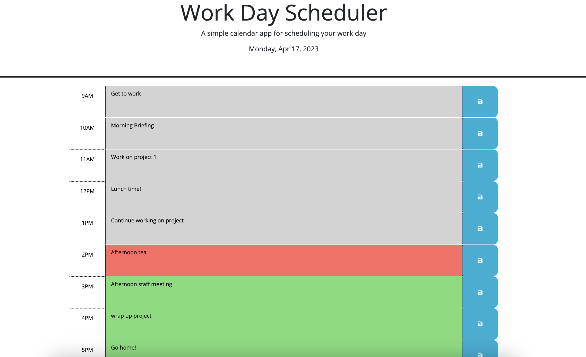

# 05 Third-Party APIs: Jenny's Work Day Scheduler

## Description

My task as an employee with a busy schedule is to create a simple calendar application that allows a user to save events for each hour of the day by modifying starter code. This app will run in the browser and feature dynamically updated HTML and CSS powered by jQuery. This app will help to manage my time more efficiently.

I've used the [Day.js](https://day.js.org/en/) library to work with date and time. 

## Usage

You can use this app by clicking on the deployed application:  https://jnaoroji.github.io/Schedule-WorkDay-JN/

## Screenshot

The following screenshot shows my web application's appearance and functionality:

## Credits

* https://developer.mozilla.org
* https://day.js.org/en/ 
* This gif was used as the predominant guideline for this Schedule App.

## License

Please refer to the LICENSE in the repo.

